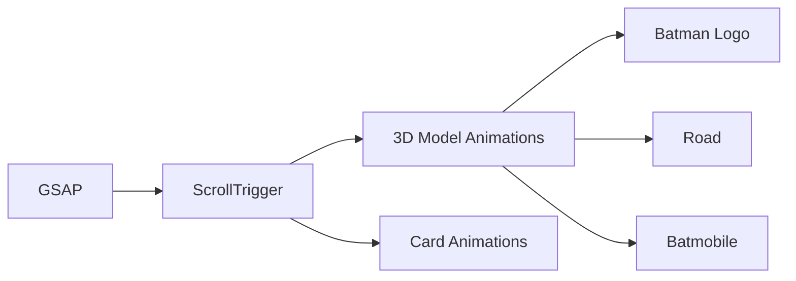

# Bilal Ahmad's Portfolio - Implementation Plan

A production-ready, fully responsive portfolio website featuring an immersive sun/moon theme system with dynamic time-based switching and stunning 3D animations.

---

## Iteration 1: Sun/Moon Theme System ✅

### Features Implemented
- **Burning Paper Reveal** - Screen starts black, reveals with fire effect
- **Sun/Moon Descent** - Celestial body fades in at top, descends like sunrise
- **Double-Click Toggle** - Theme changes only on double-click
- **Time-Based Theme** - Auto-detects day (6AM-6PM) or night
- **Atmospheric Parallax** - Stars, clouds, aurora, mountains background layers
- **Responsive Scaling** - Sun/moon resize for mobile/tablet/desktop

### Files Created
- [index.html](file:///d:/Download/portfolio/index.html) - Main HTML structure
- [css/styles.css](file:///d:/Download/portfolio/css/styles.css) - Theme tokens, animations
- [js/main.js](file:///d:/Download/portfolio/js/main.js) - Three.js scene, theme logic

---

## Iteration 2: Scroll-Driven Projects Section ✅

### Features Implemented
- **Batman Logo Intro** - 3D logo spins in when scrolling to projects
- **Road Scene** - 3D street model descends into view
- **Batmobile Movement** - Moves across screen synced to scroll progress
- **8 Project Cards** - Glassmorphism cards with hover effects
- **GSAP ScrollTrigger** - Smooth scroll-driven animations
- **Scroll Indicator** - "Scroll to explore" with animated arrow

### Technical Stack


### 3D Assets Used
| Asset | File | Scale |
|-------|------|-------|
| Batman Logo | batman_logo.glb | 0.8 |
| Road | road__avenue__street.glb | 0.3 |
| Batmobile | batmobile_armored.glb | 0.15 |

### Project Data (Placeholder)
| # | Project | Type | Tech |
|---|---------|------|------|
| 1 | Gotham Analytics | Dashboard | React, D3.js |
| 2 | Wayne Tech Portal | Web App | Next.js, Auth0 |
| 3 | Bat-Signal Alert | Mobile App | React Native |
| 4 | Arkham Database | Full Stack | Django, MongoDB |
| 5 | Cave Command | IoT | Arduino, MQTT |
| 6 | Nightwing Chat | Real-time | Socket.io |
| 7 | Oracle Vision | AI/ML | TensorFlow |
| 8 | Justice League Hub | Platform | TypeScript, GraphQL |

---

## Verification

```bash
# Start dev server
npx -y serve .
# Open http://localhost:3000
```

### Test Checklist
- [x] Intro animation (burning paper reveal)
- [x] Sun/moon double-click toggle
- [x] Scroll indicator appears
- [x] Batman logo animation on scroll
- [x] Road descends into view
- [x] Batmobile moves with scroll
- [x] 8 project cards visible
- [x] Theme toggle works throughout

---

## Design Notes

> [!IMPORTANT]
> **Placeholder Projects**: The 8 projects use Batman-themed fictional data. Replace with real project details.

> [!NOTE]
> **Performance**: GSAP ScrollTrigger used for smooth 60fps scroll animations. 3D models optimized with appropriate scaling.
